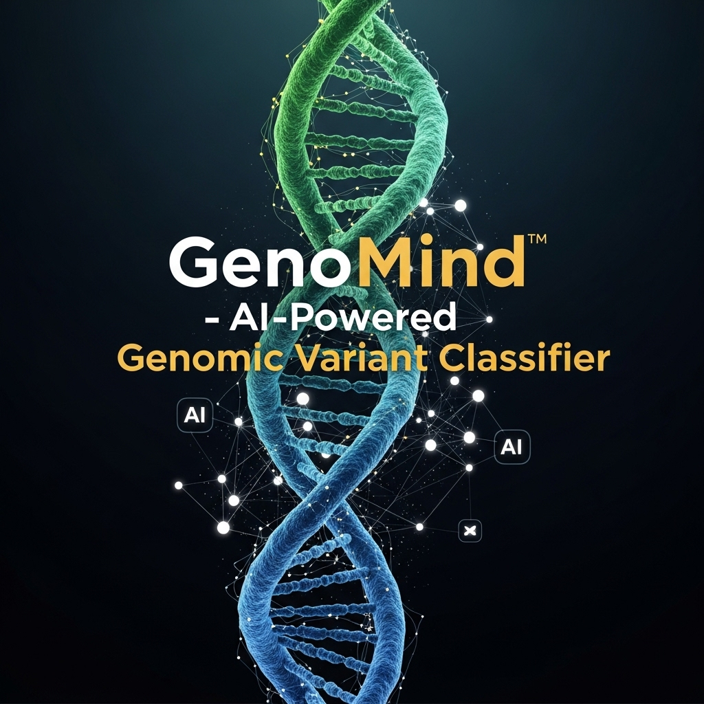

<p align="center">
  
</p>

# GenoMind - AI-Powered Genomic Variant Classifier (Frontend)

[](https://nexus-call.vercel.app)
[](https://github.com/000-KunalPal/GenoMind/blob/main/LICENSE)
[](https://github.com/000-KunalPal/GenoMind/stargazers)
[](https://github.com/000-KunalPal/GenoMind/network)

**Visit the live application:** [**https://nexus-call.vercel.app**](https://nexus-call.vercel.app)

GenoMind is a specialized biotech web application that leverages a state-of-the-art Large Language Model (Evo2) to predict the pathogenicity of genetic mutations. It provides a powerful and intuitive tool for computational biology research, enabling rapid and accurate analysis of genetic variants.

---

### **Important Note**

This repository contains the **frontend source code** for GenoMind, built with Next.js and the T3 Stack.

The AI-powered backend is a computationally intensive Python/FastAPI application that runs on Modal's serverless H100 GPU infrastructure. **The backend code and infrastructure are separate and not included in this repository.** The live frontend hosted on Vercel is configured to communicate with this high-performance backend service.

---

## Core Features

*   **Modern Full-Stack Interface**: A dynamic and responsive frontend developed with the T3 Stack (Next.js, TypeScript), utilizing Tailwind CSS and Shadcn/ui for a polished user experience. The interface allows users to seamlessly search for genes (e.g., BRCA1), browse chromosomes, and visualize genomic data.
*   **GPU-Accelerated AI Backend**: Connects to a high-performance Python backend using FastAPI, hosted on Modal's serverless H100 GPU infrastructure. This architecture serves the computationally intensive Evo2 model for real-time, accurate variant effect prediction.
*   **Real-World Data Integration & Validation**: Fetches data from authoritative bioinformatics databases, including the NCBI E-utilities and UCSC Genome Browser API, to provide crucial context and validation for model outputs.
*   **Comparative Analysis Engine**: Implemented the core analytical feature: a comparative view that contrasts the AI-driven Evo2 predictions (pathogenic/benign) against the established, gold-standard ClinVar classifications, complete with prediction confidence scores.

## Technology Architecture

### Frontend (This Repository)
*   **Framework**: Next.js
*   **Language**: TypeScript
*   **Styling**: Tailwind CSS
*   **UI Components**: Shadcn/ui
*   **Deployment**: Vercel

### Backend (Hosted Separately on Modal)
*   **Framework**: FastAPI
*   **Language**: Python
*   **AI Model**: Evo2 (Large Language Model)
*   **Infrastructure**: Modal (Serverless H100 GPU)

## Getting Started (Frontend)

To get a local copy of the frontend up and running, follow these simple steps.

### Prerequisites

*   Node.js (v18.17.0 or later)
*   npm

### Installation & Setup

1.  **Clone the repo**
    ```sh
    git clone https://github.com/000-KunalPal/GenoMind.git
    ```
2.  **Navigate to the project directory**
    ```sh
    cd GenoMind
    ```
3.  **Install NPM packages**
    ```sh
    npm install
    ```

### Running the Frontend

1.  **Start the development server**
    ```sh
    npm run dev
    ```
2.  Open [http://localhost:3000](http://localhost:3000) with your browser to see the result.

The local frontend will connect to the live, deployed backend by default. No backend setup is required to run the user interface.

## Contributing

Contributions are what make the open-source community such an amazing place to learn, inspire, and create. Any contributions you make are **greatly appreciated**.

If you have a suggestion that would make this better, please fork the repo and create a pull request. You can also simply open an issue with the tag "enhancement".

1.  Fork the Project
2.  Create your Feature Branch (`git checkout -b feature/AmazingFeature`)
3.  Commit your Changes (`git commit -m 'Add some AmazingFeature'`)
4.  Push to the Branch (`git push origin feature/AmazingFeature`)
5.  Open a Pull Request

## License

Distributed under the MIT License. See `LICENSE.md` for more information.

## Contact

Kunal Pal - [@\_KunalPal](https://x.com/kunalpal0) - kun931pal@gmail.com

Project Link: [https://github.com/000-KunalPal/GenoMind](https://github.com/000-KunalPal/GenoMind)
